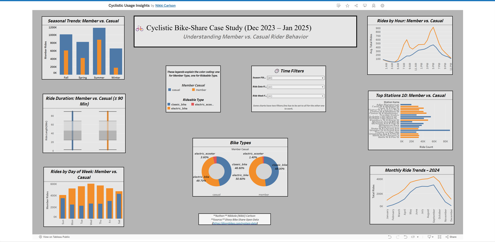

# 🚲 Cyclistic Bike-Share Case Study (Dec 2023 – Jan 2025)

**Author:** Nikkole (Nikki) Carlson  
**Last Updated:** July 2025  
**Tools Used:** R (tidyverse, lubridate, janitor), Tableau, RMarkdown

---

## 📌 Project Overview

This case study explores over **6.2 million bike-share rides** collected by Cyclistic, a fictional Chicago-based program. The goal is to identify **behavioral differences** between casual riders and members to support a **data-driven marketing strategy** aimed at increasing long-term memberships.

---

## 🔍 Key Business Questions

- How do casual and member riders differ in ride time, day, and season?
- When are the peak usage times, and how do they vary by rider type?
- What trends can be used to inform targeted promotions and retention strategies?

---

## 🧹 Data Cleaning Summary

- Merged 14 months of `.csv` trip data (Dec 2023 – Jan 2025)
- Standardized inconsistent timestamps (12-hour / 24-hour formats)
- Filtered out rides under 3 minutes or over 24 hours
- Removed invalid station coordinates (e.g., stations in Lake Michigan)
- Engineered new features:
  - Ride length (minutes)
  - Hour of day, day of week, season, and week start
  - Cleaned column names and rider categories

---

## 📊 Visualizations

Interactive Tableau dashboard showcasing key usage patterns:

- ⏰ Peak ride hours by rider type  
- ⏳ Ride duration distribution (box plot)  
- 📅 Weekly and seasonal usage trends  
- 📈 Day-of-week and time-of-day behavior  

---

### 🖼️ Dashboard Preview

---

## 🌐 Live Project Links

- 🔗 [Interactive Tableau Dashboard](https://public.tableau.com/app/profile/nikki.carlson2355/viz/CyclisticUsageInsights/CyclisticUserBehaviorAnalysis2024)  
- 📄 [Full RMarkdown Report on RPubs](https://rpubs.com/Nikki0686/1312027)

---

## 🧠 Key Findings

| Insight                               | Business Relevance                                  |
|--------------------------------------|-----------------------------------------------------|
| Casual riders peak on weekends/midday | Target recreational users with weekend promotions   |
| Members ride weekday mornings         | Align messaging with commuter habits                |
| Summer shows highest casual usage     | Launch seasonal membership campaigns                |
| Tourist hotspots have most casual use | Use geo-targeted ads near key stations              |

---

## 🧭 Strategic Recommendations

- Offer weekend in-app promotions near tourist hotspots  
- Run flexible membership trials during summer events  
- Incentivize weekday riding to build commuter habits  
- Use post-ride nudges to convert frequent casual users

---

## 🔮 Future Enhancements

- Integrate demographic overlays (e.g., age, zip code)
- Apply time series forecasting for seasonal demand
- Add anomaly detection to flag misuse or outliers

---

## 🗂️ Project Files

- `cyclistic_case_study.Rmd` – Full R script (cleaning, analysis, export)
- `bike_lake_michigan_chicago.png` – Chicago lakefront intro visual
- `Tableau_Dashboard_Cyclist_Data.png` – Dashboard preview screenshot
- *(Optional)* `Cyclistic-Bike-Share-Case-Study.html` – Knitted report (offline view)

---

## 📁 Tableau Summary Files (in `/data` folder)

- `tableau_top20_station_map.csv` – Top 20 stations for map
- `tableau_ride_length_histogram.csv` – Ride duration summary
- `tableau_weekly_rides.csv` – Weekly ride trends
- `tableau_hourly_usage.csv` – Hourly usage by rider type

> **Note:** Raw ride data (6.2M+ records) not included due to file size.  
> **Source:** [Divvy Bike Share Open Data](https://divvy-tripdata.s3.amazonaws.com/index.html)

---
